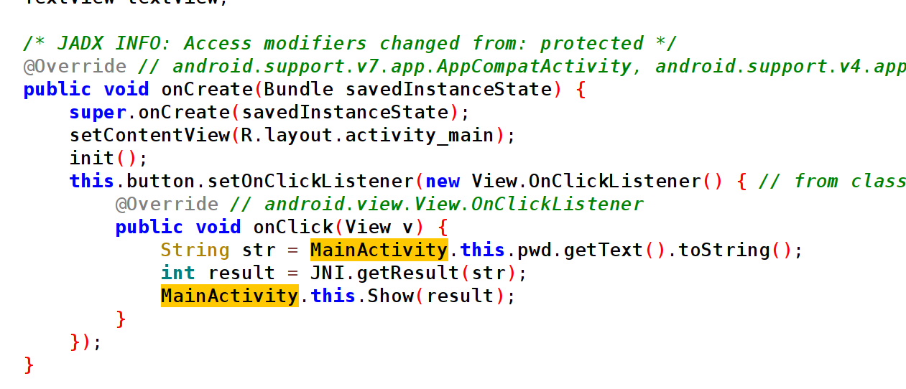
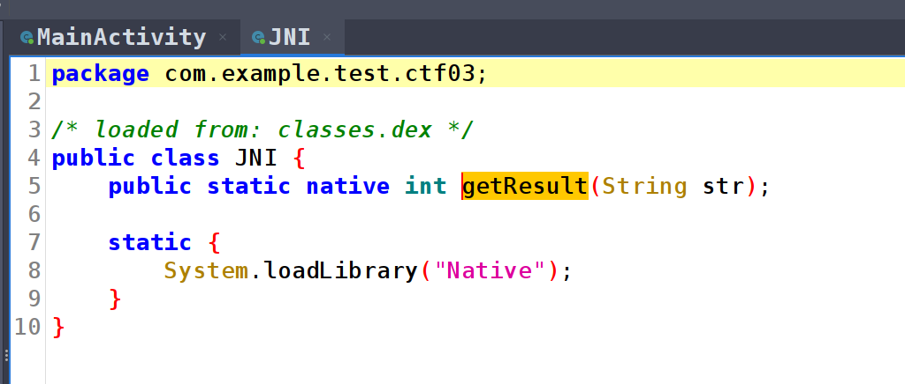
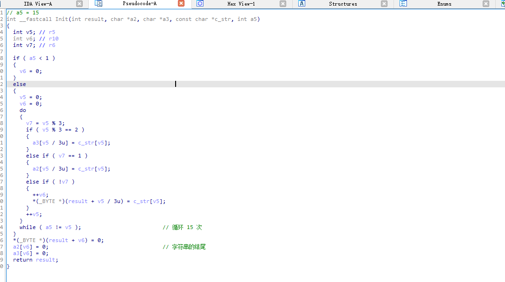

# 攻防世界-新手-Android2.0

安装并打开 APP ， 可以看到需要输入密码，我们使用 Jadx-gui 打开 ， 核心逻辑如图 3-13 所示：


图 3-13

查看 getResult 函数，如图 3-14 所示：


图 3-14

是一个 JNI 函数，我们直接去 so 查看其逻辑，如图 3-15 所示，要求输入的密码长度是 15 位


图 3-15

然后来看 Init 函数，如图 3-16 所示：


图 3-16

这段函数内容如下所示对输入的15位密码进行了操作：

```
pw => 123 456 789 abc def 

    ||
    ||
    ||
1 4 7 a d
2 5 8 b e
3 6 9 c f
```

剩下就是根据提供的信息依次异或回来就可以，脚本如下：

```python
# (a1[i] ^ 0x80)/2 = a1[i]
flag1 = "LN^dl"
for i in range(4):
    print(chr((ord(flag1[i]) ^ 0x80) // 2), end=" ")
print("l")
# result => f g o r l

result = "LN^dl"
a5 = [0x20, 0x35, 0x2D, 0x16, 0x61]
for i in range(4):
    print(chr(a5[i] ^ ord(result[i])),end=' ')
print(chr(0x61))

v7 = "AFBo}"
a5 = [0x20, 0x35, 0x2D, 0x16, 0x61]
for i in range(4):
    print(chr(a5[i] ^ ord(v7[i])),end=" ")
print("}")
# v7 => a s o y }

lst = [
    ["f","g", "o", "r", "l"],
    ["l", "{", "s", "r" ,"a"],
    ["a","s", "o", "y", "}"],
]

for j in range(5):
    print(lst[0][j],end="")
    print(lst[1][j],end="")
    print(lst[2][j],end="")


# (a1[i] ^ 0x80)/2 = a1[i]
flag1 = "LN^dl"
for i in range(4):
    print(chr((ord(flag1[i]) ^ 0x80) // 2), end=" ")
print("l")
# result => f g o r l

result = "LN^dl"
a5 = [0x20, 0x35, 0x2D, 0x16, 0x61]
for i in range(4):
    print(chr(a5[i] ^ ord(result[i])),end=' ')
print(chr(0x61))

v7 = "AFBo}"
a5 = [0x20, 0x35, 0x2D, 0x16, 0x61]
for i in range(4):
    print(chr(a5[i] ^ ord(v7[i])),end=" ")
print("}")
# v7 => a s o y }

lst = [
    ["f","g", "o", "r", "l"],
    ["l", "{", "s", "r" ,"a"],
    ["a","s", "o", "y", "}"],
]

for j in range(5):
    print(lst[0][j],end="")
    print(lst[1][j],end="")
    print(lst[2][j],end="")
```

最后就可以算出来 flag 


